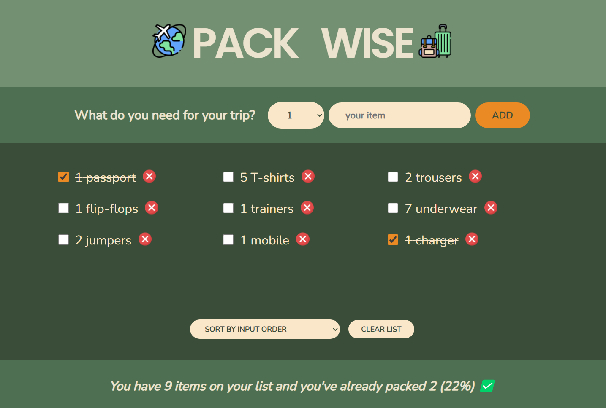

# Pack Wise travel packing list 

**Developer: Aleksandra Haniok**

💻 [Visit live website](https://pack-wise.netlify.app/)

### About

This is a React application to create a travel packing list. The project was build as part of this [React course](https://www.udemy.com/course/the-ultimate-react-course/) with Jonas Schmedtmann.

### Features

- Add items to the list
- Mark items as packed
- Remove individual item from the list
- Sort items - by input order, by alphabetical order, by packed status
- Statistics about packing status
- Clear list

### Technologies used

- HTML5
- CSS3
- JavaScript
- React

### Graphics

- All icons were taken from [Flaticon](https://www.flaticon.com/)
